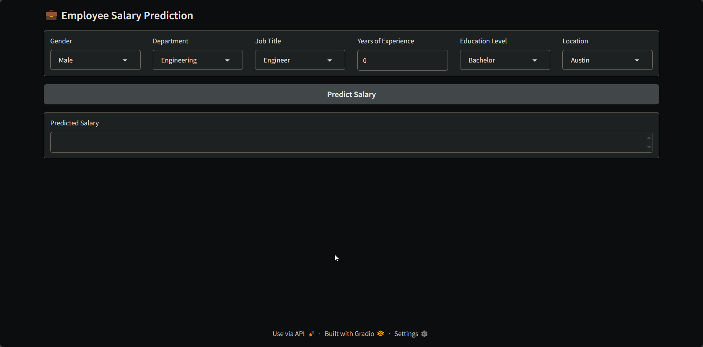

# EmployeeSalary — Predict salaries from structured inputs

[](https://www.python.org/) [](LICENSE)

A lightweight Gradio app to predict employee salaries using a pre-trained scikit-learn pipeline. 🧩

---

## Table of Contents
- [Demo](#demo)
- [Features](#features)
- [Installation / Setup](#installation--setup)
- [Usage](#usage)
- [Configuration / Options](#configuration--options)
- [Contributing](#contributing)
- [License](#license)
- [Acknowledgements / Credits](#acknowledgements--credits)

---

## Demo
Real assets from `./demo/`:

<p>
  
  
</p>

<video src="./demo/demo.mp4" controls width="100%">
  Your browser does not support the video tag.
</video>

---

## Features
- **Interactive UI** with `gradio.Blocks` for quick experimentation.
- **Pretrained pipeline** loaded from `models/linear_regression_pipeline.pkl`.
- **Clean separation** of UI (`ui.py`) and inference utilities (`utils.py`).
- **Fast predictions** on categorical and numeric inputs.

---

## Installation / Setup
Use a virtual environment for isolation.

```bash
# Create a virtual environment
python -m venv .venv

# Activate it
# On Linux/Mac:
source .venv/bin/activate
# On Windows:
.venv\Scripts\activate

# Upgrade pip (recommended)
pip install --upgrade pip

# Install dependencies
pip install -r requirements.txt
```

---

## Usage
Run the Gradio app locally:

```bash
python app.py
```

Then open the URL printed in the console (by default, something like `http://127.0.0.1:7860`).

Programmatic prediction (example):

```python
from joblib import load
from utils import predict_salary

model = load("models/linear_regression_pipeline.pkl")

pred = predict_salary(
    model,
    gender="Male",
    department="Engineering",
    job_title="Engineer",
    experience_years=5,
    education_level="Master",
    location="Seattle",
)
print(pred)
```

---

## Configuration / Options
- The app is created in `app.py` via `iface = build_ui(model, predict_salary)` and launched with `iface.launch()`.
- You can customize Gradio launch behavior by editing `app.py`, e.g.:

```python
iface.launch(server_name="0.0.0.0", server_port=7860, share=False)
```

- Replace or retrain the model by updating `models/linear_regression_pipeline.pkl` (a scikit-learn pipeline). Ensure the expected feature names match those in `utils.py`.

---

## Contributing
- Fork the repository and create a feature branch.
- Keep PRs small and focused.
- Add or update demos in `./demo/` when changing the UI/UX.
- Ensure style consistency and include clear commit messages.

---

## License
This project is licensed under the MIT License. See [LICENSE](LICENSE).

---

## Acknowledgements / Credits
- Built with [Gradio](https://www.gradio.app/) for the UI and [scikit-learn](https://scikit-learn.org/) for the model pipeline. 🚀
- The dataset/model artifacts are represented by `models/linear_regression_pipeline.pkl`.
